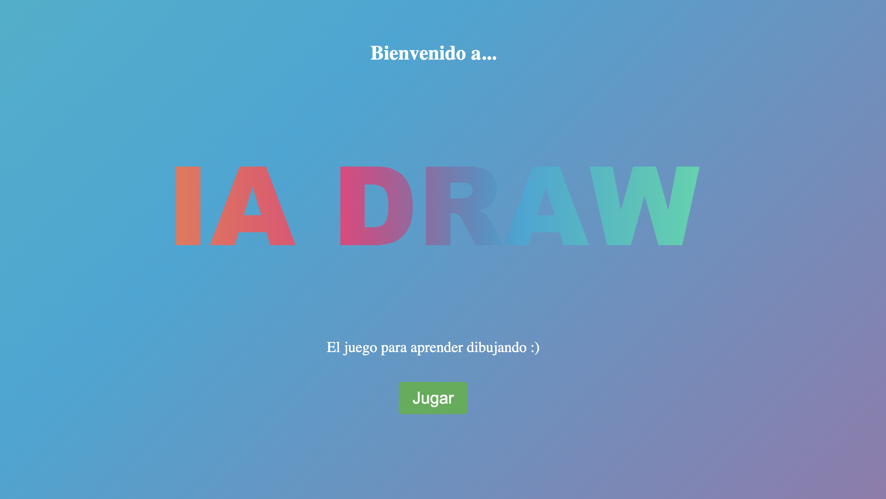

# IADraw  🎮
IA Draw es un juego interactivo donde los usuarios dibujan objetos y una inteligencia artificial intenta adivinarlos. El proyecto utiliza **TensorFlow**, **FastAPI** y **p5.js**, proporcionando una experiencia educativa que enseña tanto el reconocimiento de imágenes como la interacción con modelos de IA. El backend maneja la generación de datos, el procesamiento de imágenes y el entrenamiento de un modelo de deep learning.



## Índice
- [Instalación](#instalación)
- [Uso](#uso)
- [Características](#características)
- [Backend](#backend)
- [Estructura del Proyecto](#estructura-del-proyecto)
- [Tecnologías Utilizadas](#tecnologías-utilizadas)
- [Contribuciones](#contribuciones)
- [Licencia](#licencia)

## Instalación

1. Clona el repositorio a tu máquina local:

   ```zsh
   git clone https://github.com/melinatabor/Draw2gether.git
   ```
2. Dirígete a la carpeta del proyecto:
    ```zsh
    cd Draw2gether
    ```